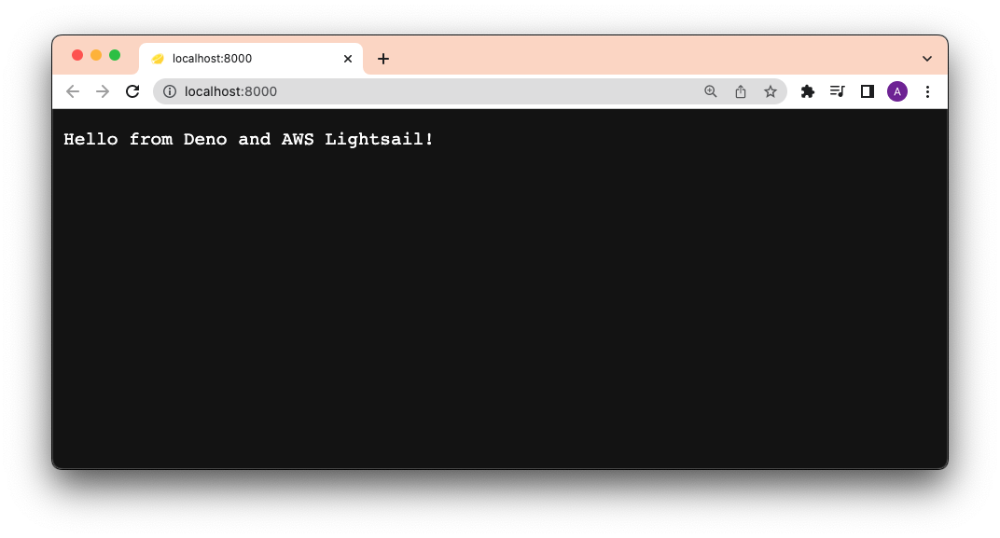
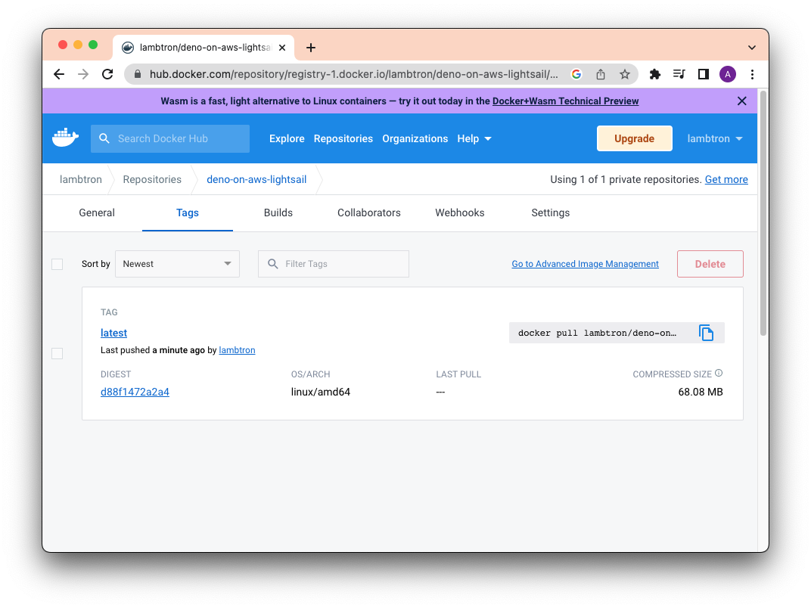
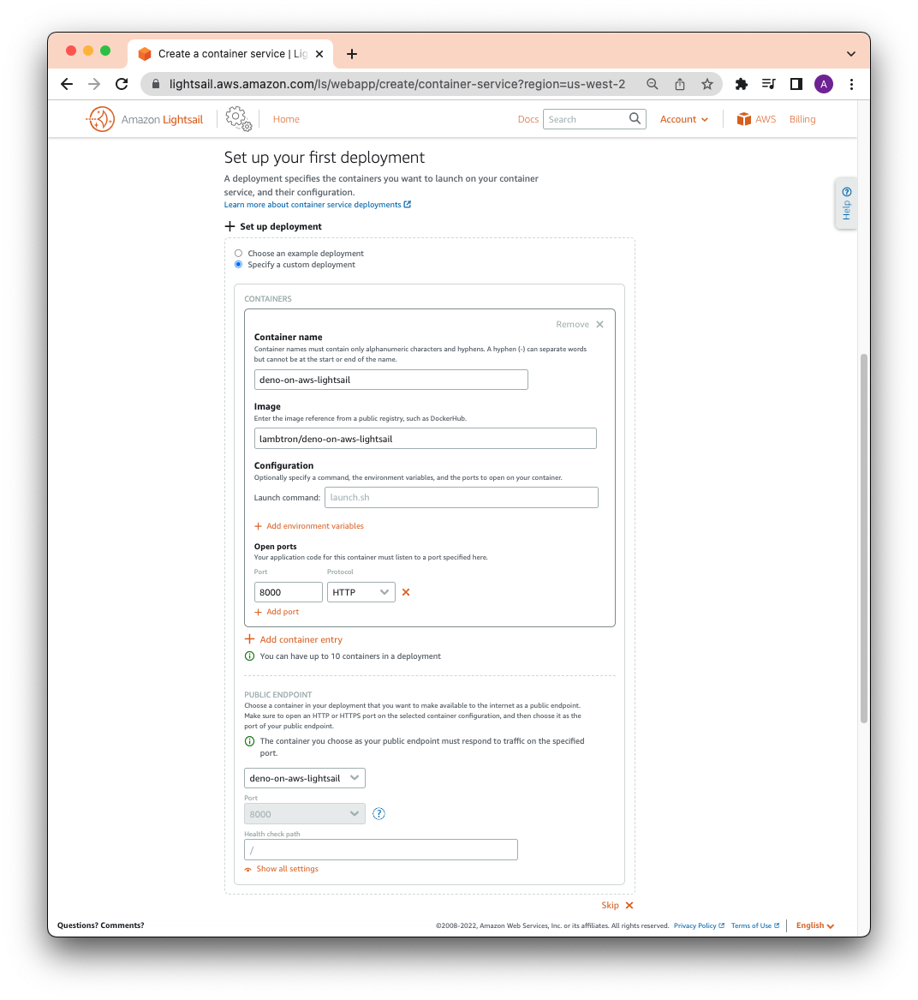
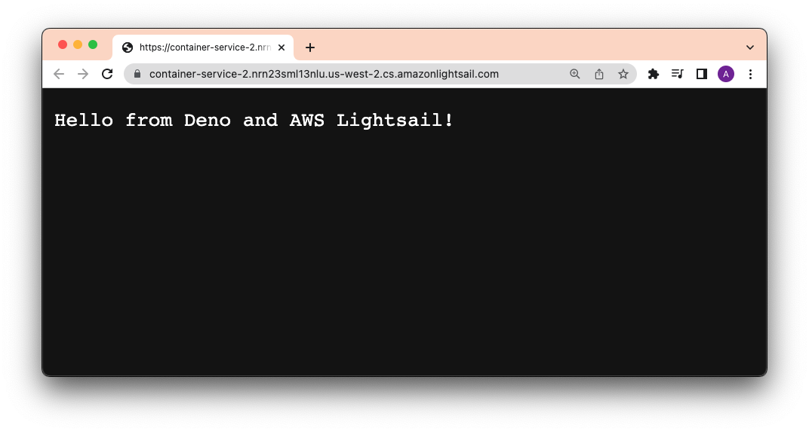

# Deploy Deno to Amazon Lightsail

[Amazon Lightsail](https://aws.amazon.com/lightsail/) is the easiest and
cheapest way to get started with Amazon Web Services. It allows you to host
virtual machines and even entire container services.

This How To guide will show you how to deploy a Deno app to Amazon Lightsail
using Docker, Docker Hub, and GitHub Actions.

Before continuing, make sure you have:

- [`docker` CLI](https://docs.docker.com/engine/reference/commandline/cli/)
- a [Docker Hub account](https://hub.docker.com)
- a [GitHub account](https://github.com)
- an [AWS account](https://aws.amazon.com/)

## Create Dockerfile and docker-compose.yml

To focus on the deployment, our app will simply be a `main.ts` file that returns
a string as an HTTP response:

```ts, ignore
import { Application } from "https://deno.land/x/oak/mod.ts";

const app = new Application();

app.use((ctx) => {
  ctx.response.body = "Hello from Deno and AWS Lightsail!";
});

await app.listen({ port: 8000 });
```

Then, we'll create two files -- `Dockerfile` and `docker-compose.yml` -- to
build the Docker image.

In our `Dockerfile`, let's add:

```Dockerfile, ignore
FROM denoland/deno

EXPOSE 8000

WORKDIR /app

ADD . /app

RUN deno cache main.ts

CMD ["run", "--allow-net", "main.ts"]
```

Then, in our `docker-compose.yml`:

```yml, ignore
version: '3'

services:
  web:
    build: .
    container_name: deno-container
    image: deno-image
    ports:
      - "8000:8000"
```

Let's test this locally by running `docker compose -f docker-compose.yml build`,
then `docker compose up`, and going to `localhost:8000`.



It works!

## Build, Tag, and Push to Docker Hub

First, let's sign into [Docker Hub](https://hub.docker.com/repositories) and
create a repository. Let's name it `deno-on-aws-lightsail`.

Then, let's tag and push our new image, replacing `username` with yours:

Then, let's build the image locally. Note our `docker-compose.yml` file will
name the build `deno-image`.

```shell, ignore
docker compose -f docker-compose.yml build
```

Let's [tag](https://docs.docker.com/engine/reference/commandline/tag/) the local
image with `{{ username }}/deno-on-aws-lightsail`:

```shell, ignore
docker tag deno-image {{ username }}/deno-on-aws-lightsail
```

We can now push the image to Docker Hub:

```shell, ignore
docker push {{ username }}/deno-on-aws-lightsail
```

After that succeeds, you should be able to see the new image on your Docker Hub
repository:



## Create and Deploy to a Lightsail Container

Let's head over to
[the Amazon Lightsail console](https://lightsail.aws.amazon.com/ls/webapp/home/container-services).

Then click "Containers" and "Create container service". Half way down the page,
click "Setup your first Deployment" and select "Specify a custom deployment".

You can write whatever container name you'd like.

In `Image`, be sure to use `{{ username }}/{{ image }}` that you have set in
your Docker Hub. For this example, it is `lambtron/deno-on-aws-lightsail`.

Let's click `Add open ports` and add `8000`.

Finally, under `PUBLIC ENDPOINT`, select the container name that you just
created.

The full form should look like below:



When you're ready, click "Create container service".

After a few moments, your new container should be deployed. Click on the public
address and you should see your Deno app:



## Automate using GitHub Actions

In order to automate that process, we'll use the `aws` CLI with the
[`lightsail` subcommand](https://awscli.amazonaws.com/v2/documentation/api/latest/reference/lightsail/push-container-image.html).

The steps in our GitHub Actions workflow will be:

1. Checkout the repo
2. Build our app as a Docker image locally
3. Install and authenticate AWS CLI
4. Push local Docker image to AWS Lightsail Container Service via CLI

Pre-requisites for this GitHub Action workflow to work:

- an AWS Lightsail Container Instance is created (see section above)
- IAM user and relevant permissions set.
  ([See here to learn more about managing access to Amazon Lightsail for an IAM user.](https://github.com/awsdocs/amazon-lightsail-developer-guide/blob/master/doc_source/amazon-lightsail-managing-access-for-an-iam-user.md))
- `AWS_ACCESS_KEY_ID` and `AWS_SUCCESS_ACCESS_KEY` for your permissioned user.
  (Follow
  [this AWS guide](https://lightsail.aws.amazon.com/ls/docs/en_us/articles/lightsail-how-to-set-up-access-keys-to-use-sdk-api-cli)
  to get generate an `AWS_ACCESS_KEY_ID` and `AWS_SUCCESS_ACCESS_KEY`.)

Let's create a new file `container.template.json`, which contains configuration
for how to make the service container deployment. Note the similarities these
option values have with the inputs we entered manually in the previous section.

```json, ignore
{
  "containers": {
    "app": {
      "image": "",
      "environment": {
        "APP_ENV": "release"
      },
      "ports": {
        "8000": "HTTP"
      }
    }
  },
  "publicEndpoint": {
    "containerName": "app",
    "containerPort": 8000,
    "healthCheck": {
      "healthyThreshold": 2,
      "unhealthyThreshold": 2,
      "timeoutSeconds": 5,
      "intervalSeconds": 10,
      "path": "/",
      "successCodes": "200-499"
    }
  }
}
```

Let's add the below to your `.github/workflows/deploy.yml` file:

```yml, ignore
name: Build and Deploy to AWS Lightsail

on:
  push:
    branches:
      - main

env:
  AWS_REGION: us-west-2
  AWS_LIGHTSAIL_SERVICE_NAME: container-service-2
jobs:
  build_and_deploy:
    name: Build and Deploy
    runs-on: ubuntu-latest
    steps:
      - name: Checkout main
        uses: actions/checkout@v2

      - name: Install Utilities
        run: |
          sudo apt-get update
          sudo apt-get install -y jq unzip
      - name: Install AWS Client
        run: |
          curl "https://awscli.amazonaws.com/awscli-exe-linux-x86_64.zip" -o "awscliv2.zip"
          unzip awscliv2.zip
          sudo ./aws/install || true
          aws --version
          curl "https://s3.us-west-2.amazonaws.com/lightsailctl/latest/linux-amd64/lightsailctl" -o "lightsailctl"
          sudo mv "lightsailctl" "/usr/local/bin/lightsailctl"
          sudo chmod +x /usr/local/bin/lightsailctl
      - name: Configure AWS credentials
        uses: aws-actions/configure-aws-credentials@v1
        with:
          aws-region: ${{ env.AWS_REGION }}
          aws-access-key-id: ${{ secrets.AWS_ACCESS_KEY_ID }}
          aws-secret-access-key: ${{ secrets.AWS_SECRET_ACCESS_KEY }}
      - name: Build Docker Image
        run: docker build -t ${{ env.AWS_LIGHTSAIL_SERVICE_NAME }}:release .
      - name: Push and Deploy
        run: |
          service_name=${{ env.AWS_LIGHTSAIL_SERVICE_NAME }}
          aws lightsail push-container-image \
            --region ${{ env.AWS_REGION }} \
            --service-name ${service_name} \
            --label ${service_name} \
            --image ${service_name}:release
          aws lightsail get-container-images --service-name ${service_name} | jq --raw-output ".containerImages[0].image" > image.txt
          jq --arg image $(cat image.txt) '.containers.app.image = $image' container.template.json > container.json
          aws lightsail create-container-service-deployment --service-name ${service_name} --cli-input-json file://$(pwd)/container.json
```

Whoa there is a lot going on here! The last two steps are most important:
`Build Docker Image` and `Push and Deploy`.

```shell, ignore
docker build -t ${{ env.AWS_LIGHTSAIL_SERVICE_NAME }}:release .
```

This command builds our Docker image with the name `container-service-2` and
tags it `release`.

```shell, ignore
aws lightsail push-container-image ...
```

This command pushes the local image to our Lightsail container.

```shell, ignore
aws lightsail get-container-images --service-name ${service_name} | jq --raw-output ".containerImages[0].image" > image.txt
```

This command retrieves the image information and, using
[`jq`](https://stedolan.github.io/jq/), parses it and saves the image name in a
local file `image.txt`.

```shell, ignore
jq --arg image $(cat image.txt) '.containers.app.image = $image' container.template.json > container.json
```

This command uses the image name saved in `image.txt` and
`container.template.json` and creates a new options file called
`container.json`. This options file will be passed to `aws lightsail` for the
final deployment in the next step.

```shell, ignore
aws lightsail create-container-service-deployment --service-name ${service_name} --cli-input-json file://$(pwd)/container.json
```

Finally, this command creates a new deployment using the `service_name`, along
with the config settings in `container.json`.

When you push to GitHub and the Action succeeds, you'll be able to see your new
Deno app on AWS:


