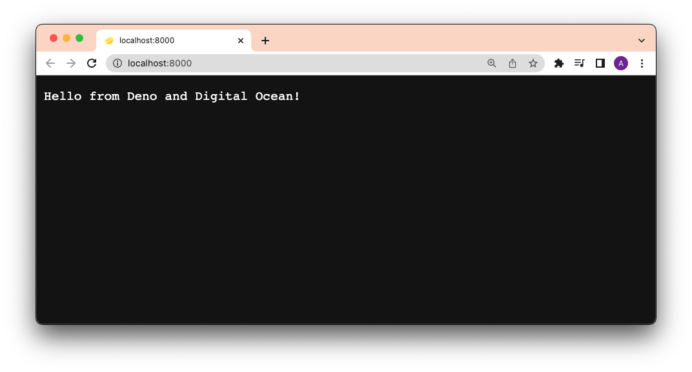
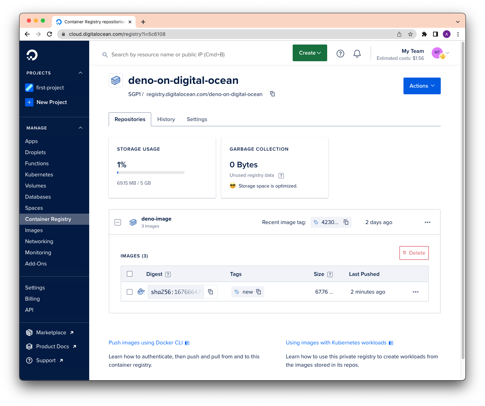
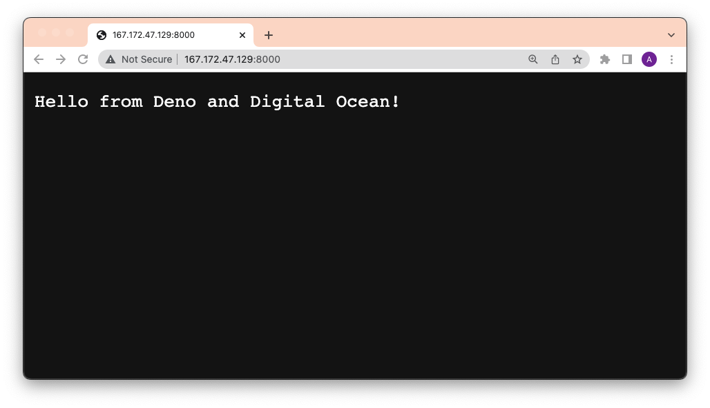

# How to Deploy Deno to Digital Ocean

Digital Ocean is a popular cloud infrastructure provider offering a variety of
hosting services ranging from networking, to compute, to storage.

Here's a step by step guide to deploying a Deno app to Digital Ocean using
Docker and GitHub Actions.

The pre-requisite for this is:

- [`docker` CLI](https://docs.docker.com/engine/reference/commandline/cli/)
- a [GitHub account](https://github.com)
- a [Digital Ocean account](https://digitalocean.com)
- [`doctl` CLI](https://docs.digitalocean.com/reference/doctl/how-to/install/)

## Create Dockerfile and docker-compose.yml

To focus on the deployment, our app will simply be a `main.ts` file that returns
a string as an HTTP response:

```ts, ignore
import { Application } from "https://deno.land/x/oak/mod.ts";

const app = new Application();

app.use((ctx) => {
  ctx.response.body = "Hello from Deno and Digital Ocean!";
});

await app.listen({ port: 8000 });
```

Then, we'll create two files -- `Dockerfile` and `docker-compose.yml` -- to
build the Docker image.

In our `Dockerfile`, let's add:

```Dockerfile, ignore
FROM denoland/deno

EXPOSE 8000

WORKDIR /app

ADD . /app

RUN deno cache main.ts

CMD ["run", "--allow-net", "main.ts"]
```

Then, in our `docker-compose.yml`:

```yml, ignore
version: '3'

services:
  web:
    build: .
    container_name: deno-container
    image: deno-image
    ports:
      - "8000:8000"
```

Let's test this locally by running `docker compose -f docker-compose.yml build`,
then `docker compose up`, and going to `localhost:8000`.



It works!

## Build, Tag, and Push your Docker image to Digital Ocean Container Registry

Digital Ocean has its own private Container Registry, with which we can push and
pull Docker images. In order to use this registry, let's
[install and authenticate `doctl` on the command line](https://docs.digitalocean.com/reference/doctl/how-to/install/).

After that, we'll create a new private registry named `deno-on-digital-ocean`:

```shell, ignore
doctl registry create deno-on-digital-ocean
```

Using our Dockerfile and docker-compose.yml, we'll build a new image, tag it,
and push it to the registry. Note that `docker-compose.yml` will name the build
locally as `deno-image`.

```shell, ignore
docker compose -f docker-compose.yml build
```

Let's [tag](https://docs.docker.com/engine/reference/commandline/tag/) it with
`new`:

```shell, ignore
docker tag deno-image registry.digitalocean.com/deno-on-digital-ocean/deno-image:new
```

Now we can push it to the registry.

```shell, ignore
docker push registry.digitalocean.com/deno-on-digital-ocean/deno-image:new
```

You should see your new `deno-image` with the `new` tag in your
[Digital Ocean container registry](https://cloud.digitalocean.com/registry):



Perfect!

## Deploy to Digital Ocean via SSH

Once our `deno-image` is in the registry, we can run it anywhere using
`docker run`. In this case, we'll run it while in our
[Digital Ocean Droplet](https://www.digitalocean.com/products/droplets), their
hosted virtual machine.

While on your [Droplet page](https://cloud.digitalocean.com/droplets), click on
your Droplet and then `console` to SSH into the virtual machine. (Or you can
[ssh directly from your command line](https://docs.digitalocean.com/products/droplets/how-to/connect-with-ssh/).)

To pull down the `deno-image` image and run it, let's run:

```shell, ignore
docker run -d --restart always -it -p 8000:8000 --name deno-image registry.digitalocean.com/deno-on-digital-ocean/deno-image:new
```

Using our browser to go to the Digital Ocean address, we now see:



Boom!

## Automate the Deployment via GitHub Actions

Let's automate that entire process with GitHub actions.

First, let's get all of our environmental variables needed for logging into
`doctl` and SSHing into the Droplet:

- [DIGITALOCEAN_ACCESS_TOKEN](https://docs.digitalocean.com/reference/api/create-personal-access-token/)
- DIGITALOCEAN_HOST (the IP address of your Droplet)
- DIGITALOCEAN_USERNAME (the default is `root`)
- DIGITALOCEAN_SSHKEY (more on this below)

### Generate `DIGITALOCEAN_SSHKEY`

The `DIGITALOCEAN_SSHKEY` is a private key where its public counterpart exists
on the virtual machine in its `~/.ssh/authorized_keys` file.

To do this, first let's run `ssh-keygen` on your local machine:

```shell, ignore
ssh-keygen
```

When prompted for an email, **be sure to use your GitHub email** for the GitHub
Action to authenticate properly. Your final output should look something like
this:

```
Output
Your identification has been saved in /your_home/.ssh/id_rsa
Your public key has been saved in /your_home/.ssh/id_rsa.pub
The key fingerprint is:
SHA256:/hk7MJ5n5aiqdfTVUZr+2Qt+qCiS7BIm5Iv0dxrc3ks user@host
The key's randomart image is:
+---[RSA 3072]----+
|                .|
|               + |
|              +  |
| .           o . |
|o       S   . o  |
| + o. .oo. ..  .o|
|o = oooooEo+ ...o|
|.. o *o+=.*+o....|
|    =+=ooB=o.... |
+----[SHA256]-----+
```

Next, we'll have to upload the newly generated public key to your Droplet. You
can either use [`ssh-copy-id`](https://www.ssh.com/academy/ssh/copy-id) or
manually copy it, ssh into your Droplet, and pasting it to
`~/.ssh/authorized_keys`.

Using `ssh-copy-id`:

```shell, ignore
ssh-copy-id {{ username }}@{{ host }}
```

This command will prompt you for the password. Note that this will automatically
copy `id_rsa.pub` key from your local machine and paste it to your Droplet's
`~/.ssh/authorized_keys` file. If you've named your key something other than
`id_rsa`, you can pass it with the `-i` flag to the command:

```shell, ignore
ssh-copy-id -i ~/.ssh/mykey {{ username }}@{{ host }}
```

To test whether this is done successfully:

```shell, ignore
ssh -i ~/.ssh/mykey {{ username }}@{{ host }}
```

Awesome!

### Define the yml File

The final step is to put this all together. We're basically taking each step
during the manual deployment and adding them to a GitHub Actions workflow yml
file:

```yml, ignore
name: Deploy to Digital Ocean

on:
  push:
    branches:
      - main

env:
  REGISTRY: "registry.digitalocean.com/deno-on-digital-ocean"
  IMAGE_NAME: "deno-image"

jobs:
  build_and_push:
    name: Build, Push, and Deploy
    runs-on: ubuntu-latest
    steps:
    - name: Checkout main
      uses: actions/checkout@v2

    - name: Set $TAG from shortened sha
      run: echo "TAG=`echo ${GITHUB_SHA} | cut -c1-8`" >> $GITHUB_ENV

    - name: Build container image
      run: docker compose -f docker-compose.yml build

    - name: Tag container image
      run: docker tag ${{ env.IMAGE_NAME }} ${{ env.REGISTRY }}/${{ env.IMAGE_NAME }}:${{ env.TAG }}

    - name: Install `doctl`
      uses: digitalocean/action-doctl@v2
      with:
        token: ${{ secrets.DIGITALOCEAN_ACCESS_TOKEN }}

    - name: Log in to Digital Ocean Container Registry
      run: doctl registry login --expiry-seconds 600

    - name: Push image to Digital Ocean Container Registry
      run: docker push ${{ env.REGISTRY }}/${{ env.IMAGE_NAME }}:${{ env.TAG }}

    - name: Deploy via SSH
      uses: appleboy/ssh-action@master
      with:
        host: ${{ secrets.DIGITALOCEAN_HOST }}
        username: ${{ secrets.DIGITALOCEAN_USERNAME }}
        key: ${{ secrets.DIGITALOCEAN_SSHKEY }}
        script: |
          # Login to Digital Ocean Container Registry
          docker login -u ${{ secrets.DIGITALOCEAN_ACCESS_TOKEN }} -p ${{ secrets.DIGITALOCEAN_ACCESS_TOKEN }} registry.digitalocean.com
          # Stop and remove a running image.
          docker stop ${{ env.IMAGE_NAME }}
          docker rm ${{ env.IMAGE_NAME }}
          # Run a new container from a new image
          docker run -d --restart always -it -p 8000:8000 --name ${{ env.IMAGE_NAME }} ${{ env.REGISTRY }}/${{ env.IMAGE_NAME }}:${{ env.TAG }}
```

When you push to GitHub, this yml file is automatically detected, triggering the
Deploy action.
