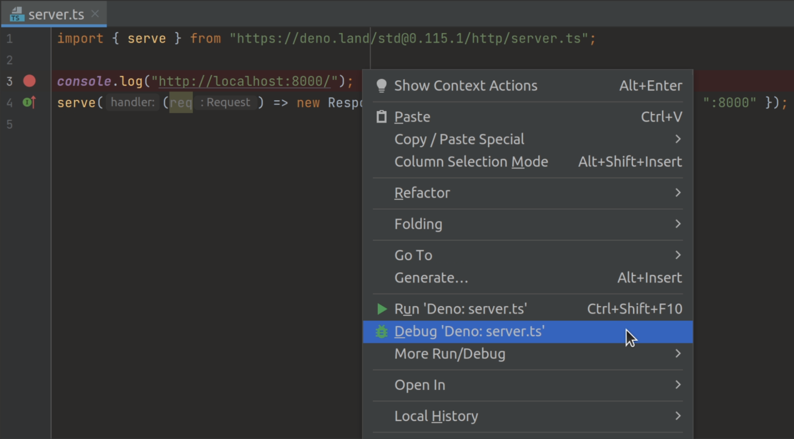

# Debugging Your Code

Deno supports the [V8 Inspector Protocol](https://v8.dev/docs/inspector) used by
Chrome, Edge and Node.js. This makes it possible to debug Deno programs using
Chrome DevTools or other clients that support the protocol (for example VSCode).

To activate debugging capabilities run Deno with the `--inspect` or
`--inspect-brk` flags.

The `--inspect` flag allows attaching the debugger at any point in time, while
`--inspect-brk` will wait for the debugger to attach and will pause execution on
the first line of code.

> ⚠️ If you use `--inspect` flag, the code will start executing immediately. If
> your program is short, you might not have enough time to connect the debugger
> before the program finishes execution. In such cases, try running with
> `--inspect-brk` flag instead, or add a timeout at the end of your code.

## Chrome Devtools

Let's try debugging a program using Chrome Devtools. For this, we'll use
[file_server.ts](https://deno.land/std@$STD_VERSION/http/file_server.ts) from
`std`, a static file server.

Use the `--inspect-brk` flag to break execution on the first line:

```shell
$ deno run --inspect-brk --allow-read --allow-net https://deno.land/std@$STD_VERSION/http/file_server.ts
Debugger listening on ws://127.0.0.1:9229/ws/1e82c406-85a9-44ab-86b6-7341583480b1
Download https://deno.land/std@$STD_VERSION/http/file_server.ts
Compile https://deno.land/std@$STD_VERSION/http/file_server.ts
...
```

In a Chromium derived browser such as Google Chrome or Microsoft Edge, open
`chrome://inspect` and click `Inspect` next to target:


It might take a few seconds after opening the DevTools to load all modules.


You might notice that DevTools pauses execution on the first line of
`_constants.ts` instead of `file_server.ts`. This is expected behavior caused by
the way ES modules are evaluated in JavaScript (`_constants.ts` is left-most,
bottom-most dependency of `file_server.ts` so it is evaluated first).

At this point all source code is available in the DevTools, so let's open up
`file_server.ts` and add a breakpoint there; go to "Sources" pane and expand the
tree:


_Looking closely you'll find duplicate entries for each file; one written
regularly and one in italics. The former is compiled source file (so in the case
of `.ts` files it will be emitted JavaScript source), while the latter is a
source map for the file._

Next, add a breakpoint in the `listenAndServe` method:


As soon as we've added the breakpoint, DevTools automatically opens up the
source map file, which allows us step through the actual source code that
includes types.

Now that we have our breakpoints set, we can resume the execution of our script
so that we can inspect an incoming request. Hit the "Resume script execution"
button to do so. You might even need to hit it twice!

Once our script is running, try send a request and inspect it in Devtools:

```
$ curl http://0.0.0.0:4507/
```


At this point we can introspect the contents of the request and go step-by-step
to debug the code.

## VSCode

Deno can be debugged using VSCode. This is best done with help from the official
`vscode_deno` extension. Documentation for this can be found
[here](../references/vscode_deno#using-the-debugger).

## JetBrains IDEs

_**Note**: make sure you have
[this Deno plugin](https://plugins.jetbrains.com/plugin/14382-deno) installed
and enabled in Preferences / Settings | Plugins. For more information, see
[this blog post](https://blog.jetbrains.com/webstorm/2020/06/deno-support-in-jetbrains-ides/)._

You can debug Deno using your JetBrains IDE by right-clicking the file you want
to debug and selecting the `Debug 'Deno: <file name>'` option.



This will create a run/debug configuration with no permission flags set. If you
want to configure them, open your run/debug configuration and add the required
flags to the `Command` field.

## Other

Any client that implements the DevTools protocol should be able to connect to a
Deno process.
