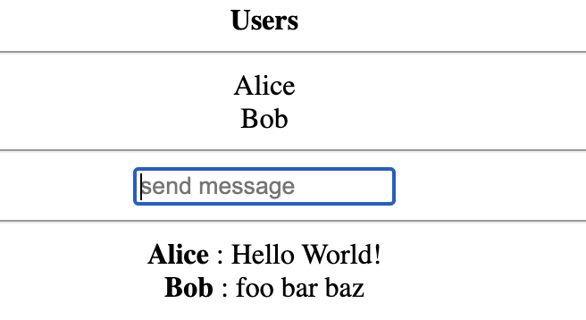

## Introduction

In this tutorial we’ll create a simple chat app using Deno. Our chat app will
allow multiple chat clients connected to the same backend to send group messages
through web sockets. After a client chooses a username, they can then start
sending group messages to other online clients. Each client also displays the
list of currently active users.



## Building the View

We can build the simple UI shown above with the following as our `index.html`.
Note that the `app.js` script is our chat client (which will be discussed in
detail later)

```html
<!-- index.html -->

<html>
  <head>
    <title>Chat App</title>
    <script src="/public/app.js"></script>
  </head>
  <body>
    <div style="text-align: center">
      <div>
        <b>Users</b>
        <hr />
        <div id="users"></div>
        <hr class="visible-xs visible-sm" />
      </div>
      <div>
        <input id="data" placeholder="send message" />
        <hr />
        <div id="conversation"></div>
      </div>
    </div>
  </body>
</html>
```

## **WebSocket** Primer

We will rely on Deno’s native support for web sockets when building our client
and server. A
[web socket](https://developer.mozilla.org/en-US/docs/Web/API/WebSocket) is a
bidirectional communication channel that allows the both the client and server
to send messages to each other at any time. Web sockets are frequently used in
realtime applications where low latency is critical. Each of our clients will
keep a web socket connection open to our server so they can receive the latest
messages and user logins without constantly polling.

## Chat Client

The chat client `app.js` runs in the browser and listens for updates from our
server and then manipulates the DOM. Specifically our client is listening for
new messages and the list of currently active users. We need to add event
handlers to our client’s web socket to specify what happens when our clients
receives a new message or event.

```jsx
// app.js

const myUsername = prompt("Please enter your name") || "Anonymous";
const socket = new WebSocket(
  `ws://localhost:8080/start_web_socket?username=${myUsername}`,
);

socket.onmessage = (m) => {
  const data = JSON.parse(m.data);

  switch (data.event) {
    case "update-users":
      // refresh displayed user list
      let userListHtml = "";
      for (const username of data.usernames) {
        userListHtml += `<div> ${username} </div>`;
      }
      document.getElementById("users").innerHTML = userListHtml;
      break;

    case "send-message":
      // display new chat message
      addMessage(data.username, data.message);
      break;
  }
};

function addMessage(username, message) {
  // displays new message
  document.getElementById(
    "conversation",
  ).innerHTML += `<b> ${username} </b>: ${message} <br/>`;
}

// on page load
window.onload = () => {
  // when the client hits the ENTER key
  document.getElementById("data").addEventListener("keypress", (e) => {
    if (e.key === "Enter") {
      const inputElement = document.getElementById("data");
      var message = inputElement.value;
      inputElement.value = "";
      socket.send(
        JSON.stringify({
          event: "send-message",
          message: message,
        }),
      );
    }
  });
};
```

## Chat Server

[oak](https://deno.land/x/oak@v11.1.0) is the Deno middleware framework that
we’ll be using to set up our server. Our server will return the plain
`index.html` file previously shown when the user first navigates to the site.
Our server also exposes a `ws_endpoint/` endpoint which the chat clients will
use to create their web socket connection. Note that the client’s initial HTTP
connection is converted into a WebSocket connection by the server via HTTP’s
[protocol upgrade mechanism](https://developer.mozilla.org/en-US/docs/Web/HTTP/Protocol_upgrade_mechanism).
Our server will maintain web socket connections with each active client and tell
them which users are currently active. Our server will also broadcast a message
to all active clients whenever there is a new message so that each client can
display it.

```jsx
// server.js

import { Application, Router } from "https://deno.land/x/oak/mod.ts";

const connectedClients = new Map();

const app = new Application();
const port = 8080;
const router = new Router();

// send a message to all connected clients
function broadcast(message) {
  for (const client of connectedClients.values()) {
    client.send(message);
  }
}

// send updated users list to all connected clients
function broadcast_usernames() {
  const usernames = [...connectedClients.keys()];
  console.log(
    "Sending updated username list to all clients: " +
      JSON.stringify(usernames),
  );
  broadcast(
    JSON.stringify({
      event: "update-users",
      usernames: usernames,
    }),
  );
}

router.get("/start_web_socket", async (ctx) => {
  const socket = await ctx.upgrade();
  const username = ctx.request.url.searchParams.get("username");
  if (connectedClients.has(username)) {
    socket.close(1008, `Username ${username} is already taken`);
    return;
  }
  socket.username = username;
  connectedClients.set(username, socket);
  console.log(`New client connected: ${username}`);

  // broadcast the active users list when a new user logs in
  socket.onopen = () => {
    broadcast_usernames();
  };

  // when a client disconnects, remove them from the connected clients list
  // and broadcast the active users list
  socket.onclose = () => {
    console.log(`Client ${socket.username} disconnected`);
    connectedClients.delete(socket.username);
    broadcast_usernames();
  };

  // broadcast new message if someone sent one
  socket.onmessage = (m) => {
    const data = JSON.parse(m.data);
    switch (data.event) {
      case "send-message":
        broadcast(
          JSON.stringify({
            event: "send-message",
            username: socket.username,
            message: data.message,
          }),
        );
        break;
    }
  };
});

app.use(router.routes());
app.use(router.allowedMethods());
app.use(async (context) => {
  await context.send({
    root: `${Deno.cwd()}/`,
    index: "public/index.html",
  });
});

console.log("Listening at http://localhost:" + port);
await app.listen({ port });
```

We can start our server with the following command. Note we need to explicitly
grant access to the file system and network because Deno is secure by default.

```sh
deno run --allow-read --allow-net server.js
```

Now if you visit [http://localhost:8080](http://localhost:8080/) you will be
able to start a chat session. You can open 2 simultaneous windows and try
chatting with yourself.

## Example Code

You can find the entire example code
[here](https://github.com/awelm/deno-chat-app).
