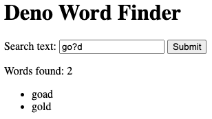

# Building a Word Finder App with Deno

## Getting Started

In this tutorial we’ll create a simple Word Finder web application using Deno.
No prior knowledge of Deno is required.

## Introduction

Our Word Finder application will take a pattern string provided by the user and
return all words in the English dictionary that match the pattern. The pattern
can include alphabetical characters as well as `_` and `?`. The `?` can stand
for any letter that isn’t present in the pattern. `_` can stand for any letter.

For example, the pattern `c?t` matches “cat” and “cut”. The pattern `go?d`
matches the words “goad” and “gold” (but not “good”).



## Building the View

The function below renders the HTML that creates the simple UI displayed above.
You can specify a pattern and list of words to customize the HTML content. If a
pattern is specified then it will show up in the search text box. If the word
list is specified, then a bulleted list of words will be rendered.

```jsx
// render.js

export function renderHtml(pattern, words) {
  let searchResultsContent = "";
  if (words.length > 0) {
    let wordList = "";
    for (const word of words) {
      wordList += `<li>${word}</li>`;
    }
    searchResultsContent = `
        <p id="search-result-count" data-count="${words.length}">Words found: ${words.length}</p>
        <ul id="search-result" name="search-results"> 
          ${wordList}
        </ul>
      `;
  }

  return `<html>
    <head>
        <title>Deno Word Finder</title>
        <meta name="version" content="1.0" />
    </head>
    <body>
        <h1>Deno Word Finder</h1>
  
        <form id="perform-search" name="perform-search" method="get" action="/api/search">
            <label for="search-text">Search text:</label>
            <input id="search-text" name="search-text" type="text" value="${pattern}" />
            <input type="submit" />
        </form>
  
        ${searchResultsContent}
  
        <h2>Instructions</h2>
  
        <p>
            Enter a word using _ and ? as needed for unknown characters. Using ? means to include letters that aren't already used (you can think of it as a "Wheel of Fortune" placeholder). Using _ will find words that contain any character (whether it's currently "revealed" or not).
            <br />
            <br />
            For example, d__d would return:
            <ul>
                <li>dand</li>
                <li>daud</li>
                <li>dead</li>
                <li>deed</li>
                <li>dird</li>
                <li>dodd</li>
                <li>dowd</li>
                <li>duad</li>
                <li>dyad</li>
            </ul>
            <br />
            And go?d would return:
            <ul>
                <li>goad</li>
                <li>gold</li>
            </ul>
        </p>
    </body>
  </html>
  `;
}
```

## Searching the Dictionary

We also need a simple search function which scans the dictionary and returns all
words that match the specified pattern. The function below takes a pattern and
dictionary and then returns all matched words.

```jsx
// search.js

export function search(pattern, dictionary) {
  // Create regex pattern that excludes characters already present in word
  let excludeRegex = "";
  for (let i = 0; i < pattern.length; i++) {
    const c = pattern[i];
    if (c != "?" && c != "_") {
      excludeRegex += "^" + c;
    }
  }
  excludeRegex = "[" + excludeRegex + "]";

  // Let question marks only match characters not already present in word
  let searchPattern = pattern.replace(/\?/g, excludeRegex);

  // Let underscores match anything
  searchPattern = "^" + searchPattern.replace(/\_/g, "[a-z]") + "$";

  // Find all words in dictionary that match pattern
  let matches = [];
  for (let i = 0; i < dictionary.length; i++) {
    const word = dictionary[i];
    if (word.match(new RegExp(searchPattern))) {
      matches.push(word);
    }
  }

  return matches;
}
```

## Running a Deno Server

[Oak](https://deno.land/x/oak@v11.1.0) is a framework that lets you easily setup
a server in Deno (analogous to Javascript’s Express) and we’ll be using it to
host our application. Our server will use our search function to populate our
HTML template with data and then return the customized HTML back to the viewer.
We can conveniently rely on the `/usr/share/dict/words` file as our dictionary
which is a standard file present on most Unix-like operating systems.

```jsx, ignore
// server.js

import { Application, Router } from "https://deno.land/x/oak/mod.ts";
import { search } from "./search.js";
import { renderHtml } from "./render.js";

const dictionary = (await Deno.readTextFile("/usr/share/dict/words")).split(
  "\n",
);

const app = new Application();
const port = 8080;

const router = new Router();

router.get("/", async (ctx) => {
  ctx.response.body = renderHtml("", []);
});

router.get("/api/search", async (ctx) => {
  const pattern = ctx.request.url.searchParams.get("search-text");
  ctx.response.body = renderHtml(pattern, search(pattern, dictionary));
});

app.use(router.routes());
app.use(router.allowedMethods());

console.log("Listening at http://localhost:" + port);
await app.listen({ port });
```

We can start our server with the following command. Note we need to explicitly
grant access to the file system and network because Deno is secure by default.

```bash
deno run --allow-read --allow-net server.js
```

Now if you visit [http://localhost:8080](http://localhost:8080/) you should be
able to view the Word Finder app.

## Example Code

You can find the entire example code
[here](https://github.com/awelm/deno-word-finder).
