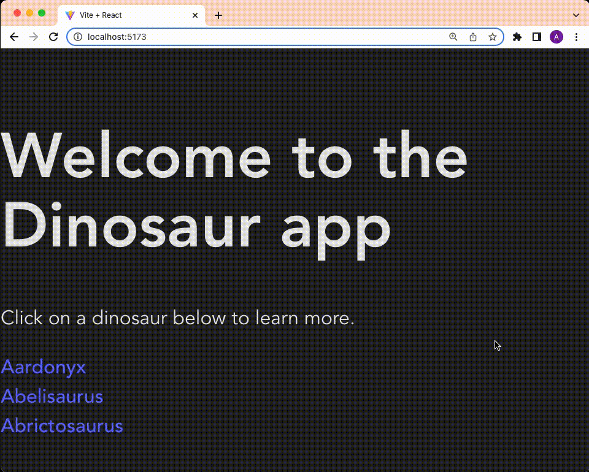
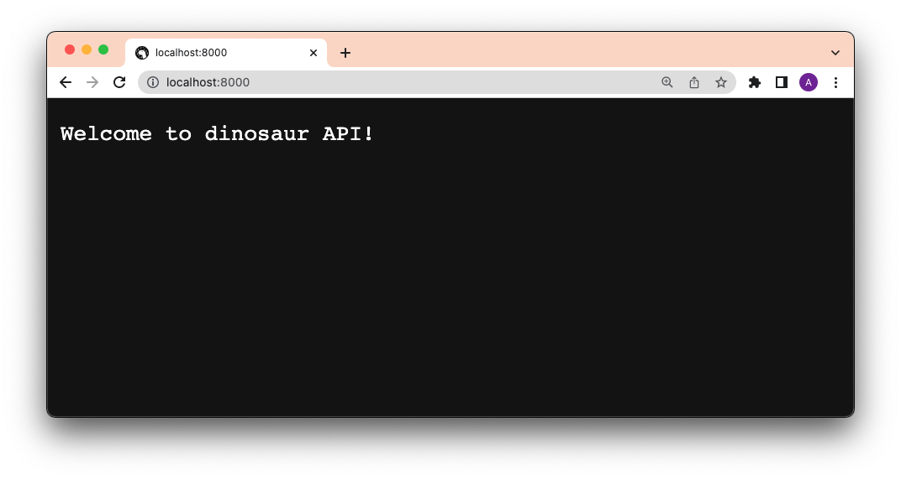

# How to use React with Deno

[React](https://reactjs.org) is the most widely used JavaScript frontend
framework. It popularized a declarative approach towards designing user
interfaces, with a reactive data model. Due to its popularity, it's not
surprising that it's the most requested framework when it comes to building web
apps with Deno.

This is a tutorial that walks you through building a simple React app with Deno
in less than five minutes. The app will display a list of dinosaurs. When you
click on one, it'll take you to a dinosaur page with more details.



[View source](https://github.com/denoland/examples/tree/main/with-react) or
[follow the video guide](https://www.youtube.com/watch?v=eStwt_2THd8).

## Create Vite Extra

This tutorial will use [Vite](https://vitejs.dev/) to quickly scaffold a Deno
and React app. Let's run:

```shell, ignore
deno run --allow-env --allow-read --allow-write npm:create-vite-extra
```

We'll name our project "dinosaur-react-app". Then, `cd` into the newly created
project folder.

## Add a backend

The next step is to add a backend API. We'll create a very simple API that
returns information about dinosaurs.

In the directory, let's create an `api` folder. In that folder, we'll create a
`main.ts` file, which will run the server, and a `data.json`, which is the hard
coded data.

```shell, ignore
mkdir api && touch api/data.json && touch api/main.ts
```

Copy and paste
[this json file](https://github.com/denoland/deno-vue-example/blob/main/api/data.json)
into your `api/data.json`.

Then, let's update `api/main.ts`:

```ts, ignore
import { Application, Router } from "https://deno.land/x/oak@v11.1.0/mod.ts";
import { oakCors } from "https://deno.land/x/cors@v1.2.2/mod.ts";
import data from "./data.json" assert { type: "json" };

const router = new Router();
router
  .get("/", (context) => {
    context.response.body = "Welcome to dinosaur API!";
  })
  .get("/api", (context) => {
    context.response.body = data;
  })
  .get("/api/:dinosaur", (context) => {
    if (context?.params?.dinosaur) {
      const found = data.find((item) =>
        item.name.toLowerCase() === context.params.dinosaur.toLowerCase()
      );
      if (found) {
        context.response.body = found;
      } else {
        context.response.body = "No dinosaurs found.";
      }
    }
  });

const app = new Application();
app.use(oakCors()); // Enable CORS for All Routes
app.use(router.routes());
app.use(router.allowedMethods());

await app.listen({ port: 8000 });
```

This is a very simple API server using [`oak`](https://deno.land/x/oak) that
will return dinosaur information based on the route. Let's start the API server:

```shell, ignore
deno run --allow-env --allow-net api/main.ts
```

If we go to `localhost:8000/api`, we see:



Lookin' good so far.

## Add a router

Our app will have two routes: `/` and `/:dinosaur`.

We'll use [`react-router-dom`](https://reactrouter.com/en/main) for our routing
logic. Let's add that to our dependencies in `vite.config.mjs`:

```mjs, ignore
import { defineConfig } from "npm:vite@^3.1.3";
import react from "npm:@vitejs/plugin-react@^2.1";

import "npm:react@^18.2";
import "npm:react-dom@^18.2/client";
import "npm:react-router-dom@^6.4"; // Add this line

// https://vitejs.dev/config/
export default defineConfig({
  plugins: [react()],
});
```

Once we add the dependencies there, we can import them without `npm:` specifier
throughout our React app.

Next, let's go to `src/App.jsx` and add our routing logic:

```jsx, ignore
import React from "react";
import {
  BrowserRouter as Router,
  Navigate,
  Route,
  Routes,
} from "react-router-dom";
import Index from "./pages/Index.jsx";
import Dinosaur from "./pages/Dinosaur.jsx";

export default function App(props) {
  return (
    <Router>
      <Routes>
        <Route exact path="/" element={<Index />} />
        <Route exact path="/:dinosaur" element={<Dinosaur />} />
        <Route path="*" element={<Navigate to="/" />} />
      </Routes>
    </Router>
  );
}
```

Next, let's add the `<Index>` and `<Dinosaur>` pages.

## Add pages

There will be two pages in this app:

- `src/pages/Index.jsx`: our index page, which lists all of the dinosaurs
- `src/pages/Dinosaur.jsx`: our dinosaur page, which shows details of the
  dinosaur

We'll create a `src/pages` folder and create the `.jsx` files:

```shell, ignore
mkdir src/pages && touch src/pages/Index.jsx src/pages/Dinosaur.jsx
```

Let's start with `<Index>`. This page will `fetch` at `localhost:8000/api` and
render that through JSX.

```jsx, ignore
import React, { useEffect, useState } from "react";
import { Link, useParams } from "react-router-dom";

const Index = () => {
  const [dinos, setDinos] = useState([]);
  useEffect(() => {
    fetch(`http://localhost:8000/api/`)
      .then(async (res) => await res.json())
      .then((json) => setDinos(json));
  }, []);

  return (
    <div>
      <h1>Welcome to the Dinosaur app</h1>
      <p>
        Click on a dinosaur below to learn more.
      </p>
      <div>
        {dinos.map((dino) => {
          return (
            <div>
              <Link to={`/${dino.name.toLowerCase()}`}>{dino.name}</Link>
            </div>
          );
        })}
      </div>
    </div>
  );
};

export default Index;
```

Next, in `<Dinosaur>`, we'll do the same except for
`localhost:8000/api/${dinosaur}`:

```jsx, ignore
import React, { useEffect, useState } from "react";
import { Link, useParams } from "react-router-dom";

const Dinosaur = () => {
  const { dinosaur } = useParams();
  const [dino, setDino] = useState({});
  useEffect(() => {
    fetch(`http://localhost:8000/api/${dinosaur}`)
      .then(async (res) => await res.json())
      .then((json) => setDino(json));
  }, []);

  return (
    <div>
      <h1>{dino.name}</h1>
      <p>
        {dino.description}
      </p>
      <Link to="/">See all</Link>
    </div>
  );
};

export default Dinosaur;
```

Let's start the React app:

```
deno task start
```

And click through the app:


Huzzah!
