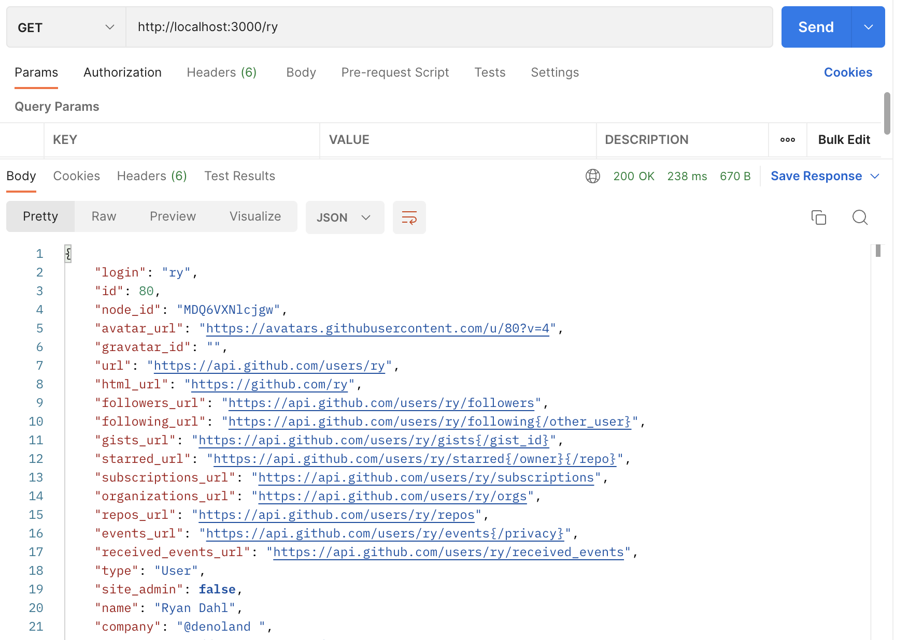
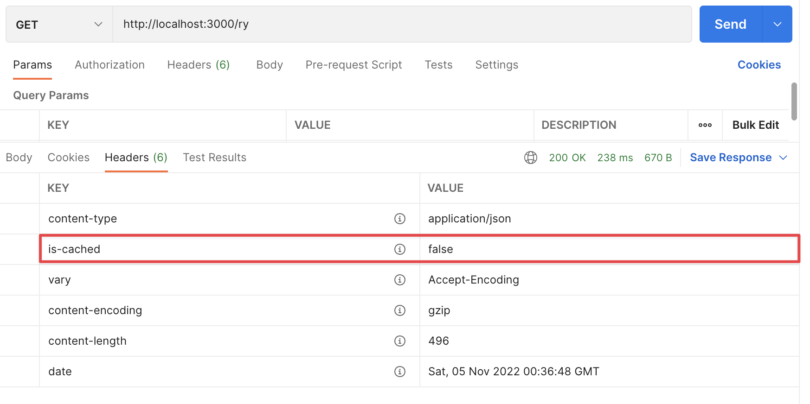
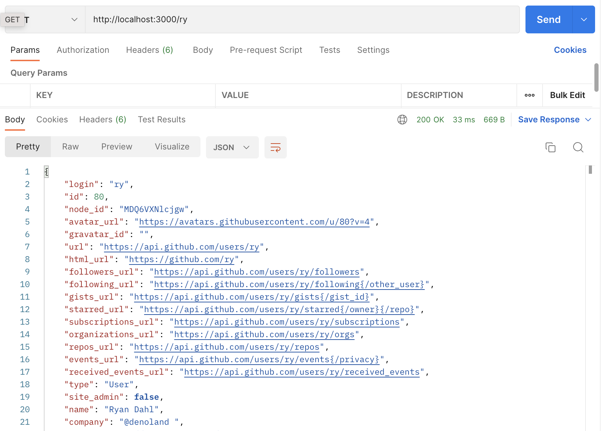
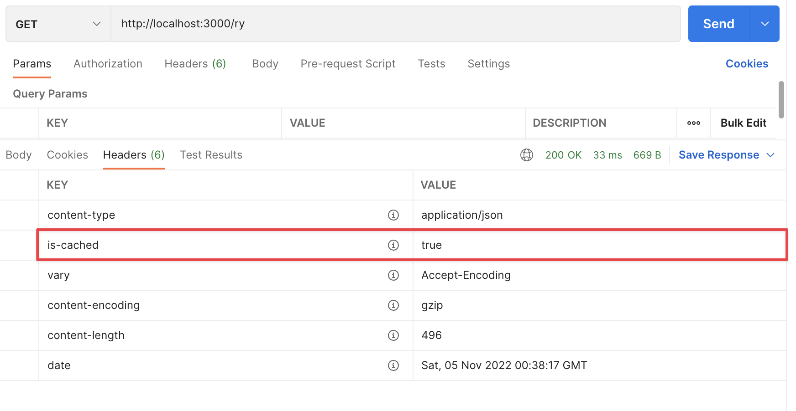

# How to Use Redis with Deno

[Redis](https://redis.io/) is an in-memory data store you can use for caching,
as a message broker, or for streaming data.

[View source here.](https://github.com/denoland/examples/tree/main/with-redis)

Here we're going to set up Redis to cache data from an API call to speed up any
subsequent requests for that data. We're going to:

- Set up a Redis client to save data from every API call in memory
- Set up a Deno server so we can easily request certain data
- Call the Github API within the server handler to get the data on first request
- Serve data from Redis on every subsequent request

We can do this within a single file, `main.ts`.

## Connecting to a Redis client

We need two modules. The first is the Deno server. We'll use this to get the
information from the user to query our API. The second is Redis. We can grab the
node package for Redis using the `npm:` modifier:

```tsx, ignore
import { Server } from "https://deno.land/std@$STD_VERSION/http/server.ts";
import { createClient } from "npm:redis@^4.5";
```

We create a Redis client using `createClient` and connect to our local Redis
server:

```tsx, ignore
// make a connection to the local instance of redis
const client = createClient({
  url: "redis://localhost:6379",
});

await client.connect();
```

You can also set host, user, password, and port individually in this
[configuration](https://github.com/redis/node-redis/blob/master/docs/client-configuration.md)
object.

## Setting up the server

Our server is going to act as a wrapper around the Github API. A client can call
our server with a Github username in the URL pathname, such as
`http://localhost:3000/{username}`.

Parsing out the pathname and calling the Github API will take place inside a
handler function in our server. We strip the leading slash so we are left with a
variable we can pass to the Github API as a username. We'll then pass the
response back to the user.

```tsx, ignore
const server = new Server({
  handler: async (req) => {
    const { pathname } = new URL(req.url);
    // strip the leading slash
    const username = pathname.substring(1);
    const resp = await fetch(`https://api.github.com/users/${username}`);
    const user = await resp.json();
    return new Response(JSON.stringify(user), {
        headers: {
          "content-type": "application/json",
        },
      });
    }
  },

  port: 3000,
});

server.listenAndServe();
```

We'll run this with:

```tsx, ignore
deno run --allow-net main.ts
```

If we then go to [http://localhost:3000/ry](http://localhost:3000/ry) in
Postman, we'll get the Github response:



Let's cache this response using Redis.

## Checking the cache

Once we have our response from the Github API, we can cache this within Redis
using `client.set`, with our username as the key and the user object as the
value:

```tsx, ignore
await client.set(username, JSON.stringify(user));
```

Next time we request the same username, we can use `client.get` to get the
cached user:

```tsx, ignore
const cached_user = await client.get(username);
```

This returns null if the key doesn't exist. So we can use it in some flow
control. When we get the username, we'll initially check whether we already have
that user in the cache. If we do we'll serve the cached result. If not, we'll
call the Github API to get the user, cache it, the serve the API result. In both
cases, we'll add a custom header to show which version we're serving:

```tsx, ignore
const server = new Server({
  handler: async (req) => {
    const { pathname } = new URL(req.url);
    // strip the leading slash
    const username = pathname.substring(1);
    const cached_user = await client.get(username);
    if (cached_user) {
      return new Response(cached_user, {
        headers: {
          "content-type": "application/json",
          "is-cached": "true",
        },
      });
    } else {
      const resp = await fetch(`https://api.github.com/users/${username}`);
      const user = await resp.json();
      await client.set(username, JSON.stringify(user));
      return new Response(JSON.stringify(user), {
        headers: {
          "content-type": "application/json",
          "is-cached": "false",
        },
      });
    }
  },

  port: 3000,
});

server.listenAndServe();
```

Running this first time gives us the same response as above, and we'll see the
`is-cached` header set to `false`:



But call with the same username again, and we get the cached result. The body is
identical:



But the header shows we have the cache:



We can also see that the response was ~200ms quicker!

You can check out the Redis documentation [here](https://redis.io/docs/) and the
Redis node package [here](https://github.com/redis/node-redis).
