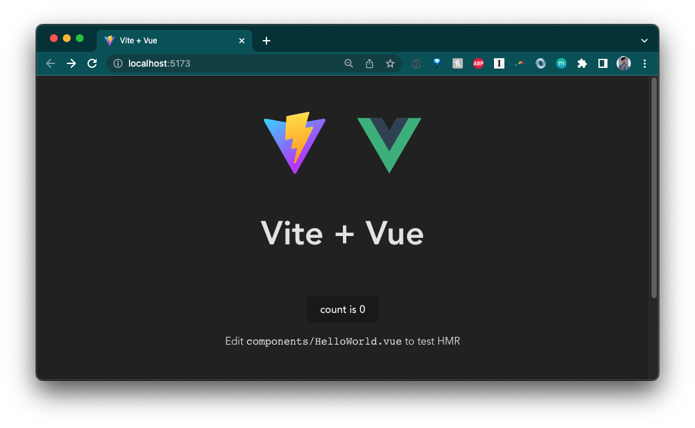
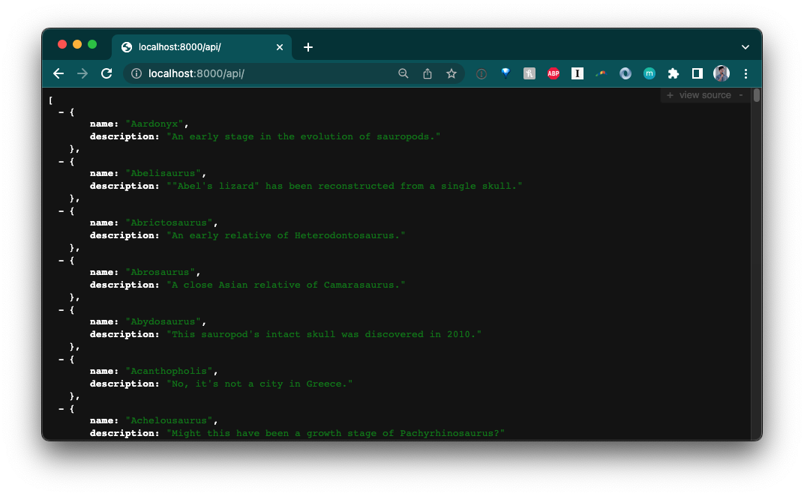
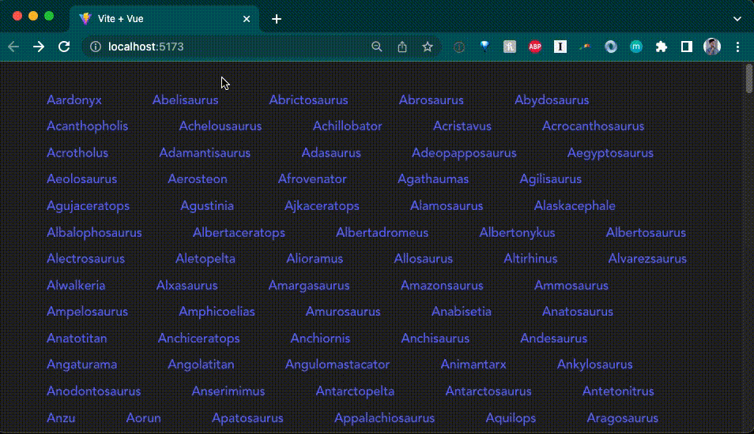

# How to use Vue with Deno

[Vue](https://vuejs.org/) is a progressive front-end JavaScript framework, built
for performance and versatility.

This How To guide will show you how to create a simple app using Deno, Vite, and
Vue.

[View source](https://github.com/denoland/examples/tree/main/with-vue) or
[follow the video guide](https://www.youtube.com/watch?v=MDPauM8fZDE).

## Run `npm:create-vite-extra`

We'll use Vite to scaffold our Vue app. First, run:

```shell, ignore
deno run --allow-read --allow-write --allow-env npm:create-vite-extra@latest
```

Name your project, then select "deno-vue".

Then, `cd` into your new project and run:

```shell, ignore
deno task dev
```

You should now be able to view your default Deno and Vue app in your browser:



## Add a backend

The next step is to add a backend API. We'll create a very simple API that
returns information about dinosaurs.

In the directory, let's create an `api` folder. In that folder, we'll create a
`main.ts` file, which will run the server, and a `data.json`, which is the hard
coded data.

```shell, ignore
mkdir api && touch api/data.json && touch api/main.ts
```

Copy and paste
[this json file](https://github.com/denoland/deno-vue-example/blob/main/api/data.json)
into your `api/data.json`.

Then, let's update `api/main.ts`:

```ts, ignore
import { Application, Router } from "https://deno.land/x/oak/mod.ts";
import { oakCors } from "https://deno.land/x/cors/mod.ts";
import data from "./data.json" assert { type: "json" };

const router = new Router();
router
  .get("/", (context) => {
    context.response.body = "Welcome to dinosaur API!";
  })
  .get("/api", (context) => {
    context.response.body = data;
  })
  .get("/api/:dinosaur", (context) => {
    if (context?.params?.dinosaur) {
      const found = data.find(item => item.name.toLowerCase() === context.params.dinosaur.toLowerCase());
      if (found) {
        context.response.body = found;
        } else {
        context.response.body = "No dinosaurs found.";
      }
    }
  });

const app = new Application();
app.use(oakCors()); // Enable CORS for All Routes
app.use(router.routes());
app.use(router.allowedMethods());

await app.listen({ port: 8000 });
```

This is a very simple API server using [`oak`](https://deno.land/x/oak) that
will return dinosaur information based on the route. Let's start the API server:

```shell, ignore
deno run --allow-env --allow-net api/main.ts
```

If we go to `localhost:8000/api`, we see:



Lookin' good so far.

## Add Vue components

Let's update `src/components`. We'll add the files:

- `HomePage.vue`, the component for the home page
- `Dinosaurs.vue`, the component that lists all dinosaur names as anchor links,
  and
- `Dinosaur.vue`, the component that shows an individual dinosaur's name and
  description

```shell, ignore
touch src/components/HomePage.vue src/components/Dinosaurs.vue src/components/Dinosaur.vue
```

Before we create the components, let's add some state management.

## Maintain state with `store`

In order to maintain state across our `<Dinosaur>` and `<Dinosaurs>` components,
we'll use [Vue store](https://vuejs.org/guide/scaling-up/state-management.html).
Note for more complex state management, check out the Vue-endorsed
[Pinia](https://pinia.vuejs.org/) library.

Create a `src/store.js` file:

```shell, ignore
touch src/store.js
```

And in it, let's add:

```js, ignore
import { reactive } from "vue";

export const store = reactive({
  dinosaur: {},
  setDinosaur(name, description) {
    this.dinosaur.name = name;
    this.dinosaur.description = description;
  },
});
```

We'll import `store` into both `Dinosaurs.vue` and `Dinosaur.vue` to set and
retrieve dinosaur name and description.

## Update Vue components

In `Dinosaurs.vue`, we'll do three things:

- send a `GET` request to our API and return that as `dinosaurs`
- iterate through `dinosaurs` and render each `dinosaur` in `<router-link>` that
  points to the `<Dinosaur>` component
- add `store.setDinosaur()` to `@click` on each `dinosaur`, which will set the
  `store`

Here is the complete code below:

```tsx, ignore
<script>
import { ref } from 'vue'
import { store } from '../store.js'
export default ({
  async setup() {
    const res = await fetch("http://localhost:8000/api")
    const dinosaurs = await res.json();
    return {
      dinosaurs
    }
  },
  data() {
    return {
      store
    }
  }
})
</script>

<template>
  <div class="container">
    <div v-for="dinosaur in dinosaurs" class="dinosaur-wrapper">
      <span class="dinosaur">
        <router-link :to="{ name: 'Dinosaur', params: { dinosaur: `${dinosaur.name.toLowerCase()}` }}">
          <span @click="store.setDinosaur(dinosaur.name, dinosaur.description)">
            {{dinosaur.name}}
          </span>
        </router-link>
      </span>
    </div>
  </div>
</template>

<style scoped>
.dinosaur {
}
.dinosaur-wrapper {
  display: inline-block;
  margin: 0.15rem 1rem;
  padding: 0.15rem 1rem;
}
.container {
  text-align: left;
}
</style>
```

In `Dinosaur.vue`, we'll add:

- importing `store`
- rendering `store.dinosaur` in the HTML

```tsx, ignore
<script>
import { store } from '../store.js';
export default {
  data() {
    return {
      store
    }
  }
}
</script>

<template>
  Name: {{ store.dinosaur.name }}
  <br />
  Description: {{ store.dinosaur.description }}
</template>
```

Next, we'll update `HomePage.vue`. Since the `Dinosaurs` component needs to
fetch the data from the API, we'll use
[`<Suspense>`](https://vuejs.org/guide/built-ins/suspense.html), which manages
async dependencies in a component tree.

```tsx, ignore
<script>
import { ref } from 'vue'
import Dinosaurs from './Dinosaurs.vue'
export default {
  components: {
    Dinosaurs
  }
}
</script>

<template>
  <Suspense>
    <template #default>
      <Dinosaurs />
    </template>
    <template #fallback>
      <div>Loading...</div>
    </template>
  </Suspense>

  <p>
    Check out
    <a href="https://vuejs.org/guide/quick-start.html#local" target="_blank"
      >create-vue</a
    >, the official Vue + Vite starter
  </p>
  <p class="read-the-docs">Learn more about using Deno and Vite.</p>
</template>

<style scoped>
.read-the-docs {
  color: #888;
}
</style>
```

Tying it all together, let's update `src/App.vue`:

```tsx, ignore
<template>
  <router-view/>
</template>
```

## Add routing

You'll notice that we have used `<router-link>` and `<router-view>`. These
components are part of the [`vue-router` library](https://router.vuejs.org/),
which we'll have to setup and configure in another file.

First, let's import `vue-router` in our `vite.config.mjs` file:

```ts, ignore
import { defineConfig } from "npm:vite@^3.1.3";
import vue from "npm:@vitejs/plugin-vue@^3.2.39";

import "npm:vue@^3.2.39";
import "npm:vue-router@4";

// https://vitejs.dev/config/
export default defineConfig({
  plugins: [vue()],
});
```

Next, let's create a folder named `router`. In it, let's create `index.ts`:

```
mkdir router && touch router/index.ts
```

In `router/index.ts`, we'll create `router`, which contains information about
each route and their component, and export it. For more information on using
`vue-router`, check out their [guide](https://router.vuejs.org/guide).

```ts, ignore
import { createRouter, createWebHistory } from "vue-router";
import HomePage from "../components/HomePage.vue";
import Dinosaur from "../components/Dinosaur.vue";

const routes = [
  {
    path: "/",
    name: "Home",
    component: HomePage,
  },
  {
    path: "/:dinosaur",
    name: "Dinosaur",
    component: Dinosaur,
    props: true,
  },
];

const router = createRouter({
  history: createWebHistory("/"),
  routes,
});

export default router;
```

Next, in our `src/main.ts` file, which contains all of the logic for the
frontend app, we'll have to import and use `router`:

```ts, ignore
import { createApp } from "vue";
import "./style.css";
import App from "./App.vue";
import router from "./router/index.ts";

const app = createApp(App);
app.use(router);
app.mount("#app");
```

Let's run it and see what we get so far:



Awesome!
