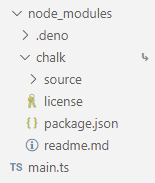

# Using npm packages with npm specifiers

Deno release 1.25 offers experimental support for npm specifiers. npm specifiers
allow you to use npm modules directly in Deno with a higher chance of
compatibility than importing from CDN's, particularly if the modules depend on
artifact files in their package.

It is important to emphasize that this feature is still under development. **npm
specifiers are extremely new** and you're likely find scenarios where something
doesn't work. Please report these problems to the
[issue tracker](https://github.com/denoland/deno/issues). We'll be working hard
to improve the compatibility layer and user experience over the next few
releases.

The way these work is best described with an example:

```ts, ignore
// main.ts
import express from "npm:express";
const app = express();

app.get("/", function (req, res) {
  res.send("Hello World");
});

app.listen(3000);
console.log("listening on http://localhost:3000/");
```

These npm specifiers have the following format:

```ts, ignore
npm:<package-name>[@<version-requirement>][/<sub-path>]
```

Then doing the following will start a simple express server:

```sh
$ deno run --unstable --A main.ts
listening on http://localhost:3000/
```

When doing this, no `npm install` is necessary and no `node_modules` folder is
created. These packages are also subject to the same permissions as Deno
applications. At the moment though, there are some unnecessary permissions that
get asked for, but in the future the above program will only require network
permissions.

These specifiers currently work with `deno run`, `deno test`, and `deno bench`.
Type checking is not yet supported. Integration for the language server,
`deno vendor`, `deno info`, and `deno install` is not yet ready either.

npm package binaries can be executed from the command line without an npm
install using a specifier in the following format:

```ts, ignore
npm:<package-name>[@<version-requirement>][/<binary-name>]
```

For example:

```sh
$ deno run --unstable --allow-env --allow-read npm:cowsay@1.5.0 Hello there!
 ______________
< Hello there! >
 --------------
        \   ^__^
         \  (oo)\_______
            (__)\       )\/\
                ||----w |
                ||     ||
$ deno run --unstable --allow-env --allow-read npm:cowsay@1.5.0/cowthink What to eat?
 ______________
( What to eat? )
 --------------
        o   ^__^
         o  (oo)\_______
            (__)\       )\/\
                ||----w |
                ||     ||
```

Similar to the previous example, this npm package requires env and read
permissions, but in the future it shouldn't require any permissions.

We'll add `deno install` and lockfile support for npm package binaries in a
future release.

Because the feature is still experimental, specifying `--unstable` is required
when importing an npm specifier.

## `--node-modules-dir` flag

npm specifiers resolve npm packages to a central global npm cache. This works
well in most cases and is ideal since it uses less space and doesn't require a
node_modules directory. That said, you may find cases where an npm package
expects itself to be executing from a `node_modules` directory. To improve
compatibility and support those packages, a new `--node-modules-dir` flag has
been added.

For example, given `main.ts`:

```ts
import chalk from "npm:chalk@5";

console.log(chalk.green("Hello"));
```

Running this script with a `--node-modules-dir` like so...

```sh
deno run --unstable --node-modules-dir main.ts
```

...will create a `node_modules` folder in the current directory with a similar
folder structure to npm.



Note that this is all done automatically when calling deno run and there is no
separate install command necessary.

In the case where you want to modify the contents of the `node_modules`
directory before execution, you can run `deno cache` with `--node-modules-dir`,
modify the contents, then run the script.

For example:

```sh
deno cache --unstable --node-modules-dir main.ts
deno run --allow-read=. --allow-write=. scripts/your_script_to_modify_node_modules_dir.ts
deno run --unstable --node-modules-dir main.ts
```
