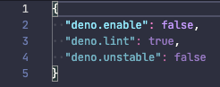

# Using Visual Studio Code

In this section we are going to go into depth about developing Deno applications
using [Visual Studio Code](https://code.visualstudio.com/) and the official
[vscode_deno](https://marketplace.visualstudio.com/items?itemName=denoland.vscode-deno)
extension.

## Installing

The vscode extension integrates directly to the Deno CLI using the language
server protocol. This helps ensure that the information you get about your code
aligns to how that code will work when you try to run it under the Deno CLI.

The Deno extension is installed like other extensions in vscode, by browsing the
extensions in vscode and choosing to install the _Deno_ extension. Or if you
have vscode installed, you can view the extension
[via this link](vscode:extension/denoland.vscode-deno) and install it if you
haven't already done so.

Once you install the extension for the first time, you should receive a _splash_
page that welcomes you to the extension. (If you missed it, or want to see it
again, just use the _Deno: Welcome_ command from the command palette.)

## Configuring the extension

The following sections will detail out how to configure the extension to work
best for you and will cover most of the settings available.

### Deno enabling a workspace

We realize that not every project you might edit with vscode is a Deno project.
By default, vscode comes with a built-in TypeScript/JavaScript language service
which is used when editing TypeScript or JavaScript files.

In order to have support for Deno APIs as well as the ability to resolve modules
as the Deno CLI does, you need to enable Deno for the workspace. The most direct
way to do this is to use the _Deno: Initialize Workspace Configuration_ from the
vscode
[command palette](https://code.visualstudio.com/docs/getstarted/userinterface#_command-palette).
This will activate a helper which will ask if you want to also enable linting
and the Deno unstable APIs for the project. This command will instruct vscode to
store these settings in the workspace configuration (your workspace root
`.vscode/settings.json`). Once the helper is finished, you will get a
notification that Deno is setup for the project.

These settings (and other settings) are available via the vscode
[settings](https://code.visualstudio.com/docs/getstarted/userinterface#_settings)
panel. In the panel the setting is _Deno: Enable_ and when manually editing the
JSON, the setting is `deno.enable`.

> ⚠️ vscode has user and workspace settings. You probably don't want to enable
> Deno in the user settings, as then by default, every workspace will be Deno
> enabled.

When a project is enabled, the extension will get information directly from the
installed Deno CLI. The extension will also _mute_ the built-in
TypeScript/JavaScript extension.

### Partially Deno enabling a workspace

While vscode supports [Workspace Folders](#workspace-folders), they can be
challenging to configure and use. Because of this, the option _Deno: Enable
Paths_ has been introduced (or `"deno.enablePaths"` if manually editing). In a
given workspace (or workspace folder), sub-paths can be enabled for Deno, while
code outside those paths will be not be enabled and the vscode built-in
JavaScript/TypeScript language server will be used.

For example if you have a project like this:

```
project
├── worker
└── front_end
```

Where you only want to enabled the `worker` path (and its subpaths) to be Deno
enabled, you will want to add `./worker` to the list of _Deno: Enable Paths_ in
the configuration.

### Using linting

The same engine that provides the diagnostics when using `deno lint` can also be
used via the extension. By enabling the _Deno: Lint_ setting in the settings
panel (or `deno.lint` if editing settings in JSON) the editor should start to
display lint "warnings" in your code. See the [Linter](./tools/linter.md)
section for more information on how to use the Deno linter.

### Using import maps

It is possible to use [import maps](./linking_to_external_code/import_maps.md)
in the editor. The option _Deno: Import Map_ (or `deno.importMap` if manually
editing) should be set to the value of the import map file. If the path is a
relative path, it will be resolved relative to the root of the workspace.

### Using a configuration file

Typically a configuration file is not required for a Deno project. There are a
few scenarios though where it might be useful, and if you want to have the same
settings applied as when specifying the `--config` option on the command line,
the _Deno: Config_ option can be used (or `deno.config` if manually editing).

The Deno extension will also auto-identify and apply a `deno.jsonc` or
`deno.jsoc` by looking in the workspace root for the configuration file and
applying it. Manually specifying a _Deno: Config_ option will override this
automatic behavior.

### Using formatting

The Deno CLI comes with a built-in formatter which can be accessed using
`deno fmt` but can also be configured to be used by vscode. _Deno_ should be on
the drop down list for the _Editor: Default formatter_ setting (or if you are
editing settings manually, it would be
`"editor.defaultFormatter": "denoland.vscode-deno"`).

See the [Code formatter](./tools/formatter.md) for more information on how to
use the formatter.

### Setting a path to the Deno CLI

The extension looks for the Deno CLI executable in the host's `PATH`, but
sometimes that isn't desirable and the _Deno: Path_ can be set (or `deno.path`
if manually editing) to point to the Deno executable. If the path provided is
relative, it will be resolved relative to the root of the workspace.

## Import suggestions

When attempting to import a module, the extension will offer suggestions to
complete the import. Local relative files will be included in the suggestions,
plus also any cached remote files.

The extension supports registry auto-completions, where a remote
registry/website of modules can optionally provide metadata that allows a client
to _discover_ modules. By default, the extension will check hosts/origins to see
if they support suggestions, and if it does, the extension will prompt you to
see if you want to enable it. This behavior can be changed by unsetting _Deno >
Suggest > Imports: Auto Discover_ (or `deno.suggest.imports.autoDiscover` if
manually editing).

Individual hosts/origins can be enabled or disabled by editing the _Deno >
Suggest > Imports: Hosts_/`deno.suggest.imports.hosts` setting in the
appropriate `settings.json`.

## Caching remote modules

Deno supports remote modules and will fetch remote modules and store them
locally in a cache. When you do something like `deno run`, `deno test`,
`deno info` or `deno cache` on the command line, the Deno CLI will go and try to
fetch any remote modules and their dependencies and populate the cache.

While developing code in the editor, if the module is not in the cache, you will
get a diagnostic like _Uncached or missing remote URL:
"`https://deno.land/example/mod.ts`"_ for any missing remote modules. Deno will
not automatically try to cache the module, unless it is a completion from a
registry import suggestion (see above).

In addition to running a command on a command line, the extension provides ways
to cache dependencies within the editor. A missing dependency will have a _quick
fix_ which is to have Deno try to cache the dependency. Fixes can be accessed by
pressing <kbd>CTRL</kbd> <kbd>.</kbd> or <kbd>⌘</kbd> <kbd>.</kbd> when the
editor is positioned in the import specifier, or hovering over the specifier and
selecting _Quick Fix..._.

There is also the _Deno: Cache Dependencies_ command in the command palette
which will attempt to cache any dependencies of the module currently active in
the editor.

## Code lenses

The language server currently supports several code lenses (actionable
contextual information interspersed in the code) that allow you to get greater
insight into the code. Most are disabled by default, but can easily be enabled:

- _Deno > Code Lens: Implementations_/`deno.codeLens.implementations` - Provides
  a lens that will list out any implementations of an item elsewhere in the
  code.
- _Deno > Code Lens: References_/`deno.codeLens.references` - Provides a lens
  that will list out any references to an item elsewhere in the code.
- _Deno > Code Lens: References All
  Functions_/`deno.codeLens.referencesAllFunctions` - Provides a lens that will
  list out all references to all functions in the code. All functions are
  excluded from just _References_ mention above.

## Testing code lens

The Deno CLI includes a [built-in testing API](./testing.md) available under
`Deno.test`. The extension and language server have a code lens enabled by
default which provides the ability to run a test from within the editor.

When you have a block of code that provides a test, like:

```ts
import { assert } from "https://deno.land/std@$STD_VERSION/testing/asserts.ts";

Deno.test({
  name: "a test case",
  fn() {
    let someCondition = true;
    assert(someCondition);
  },
});
```

You will see a code lens like the following just above the test:

```
▶ Run Test
```

This is a link that if you click it, the extension will start up the Deno CLI to
run the test for you and display the output. Based on your other settings, the
extension will try to run your test with the same settings. If you need to
adjust the arguments provided when doing `deno test`, you can do so by setting
the `deno.codeLens.testArgs` setting.

The extension will also try to track if in the same module you destructure the
`Deno.test` function or assign it to a variable. So you can do something like
this and still have the code lens work:

```ts
const { test: denoTest } = Deno;

denoTest({
  name: "example test",
  fn() {},
});
```

If you want to disable this feature, you can do so by unsetting the _Deno >
CodeLens: Test_/`deno.codeLens.test` setting.

## Using the debugger

[TBC]

## Tasks

The extension communicates directly to the language server, but for some
development tasks, you might want to execute the CLI directly. The extension
provides a task definition for allowing you to create tasks that execute the
`deno` CLI from within the editor.

### Deno CLI tasks

The template for the Deno CLI tasks has the following interface, which can be
configured in a `tasks.json` within your workspace:

```ts
interface DenoTaskDefinition {
  type: "deno";
  // This is the `deno` command to run (e.g. `run`, `test`, `cache`, etc.)
  command: string;
  // Additional arguments pass on the command line
  args?: string[];
  // The current working directory to execute the command
  cwd?: string;
  // Any environment variables that should be set when executing
  env?: Record<string, string>;
}
```

Several of the commands that are useful in the editor are configured as
templates and can be added to your workspace by select _Tasks: Configure Task_
in the command palette and searching for `deno` tasks.

And example of what a `deno run mod.ts` would look like in a `tasks.json`:

```json
{
  "version": "2.0.0",
  "tasks": [
    {
      "type": "deno",
      "command": "run",
      "args": [
        "mod.ts"
      ],
      "problemMatcher": [
        "$deno"
      ],
      "label": "deno: run"
    }
  ]
}
```

## Workspace folders

The Deno language server and this extension supports
[multi-root workspaces](https://code.visualstudio.com/docs/editor/multi-root-workspaces)
configuration, where certain settings can be applied to workspace folders within
a workspace.

When you add folders to your workspace and open the settings, you will have
access to the per folder settings. If you look at the `.vscode/settings.json` in
a folder, you will see a visual indication of what settings apply to folder,
versus those that come from the workspace configuration:



### Workspace folder settings

These are the settings that can be set on a workspace folder. The rest of the
settings currently only apply to the workspace:

- `deno.enable` - Controls if the Deno Language Server is enabled. When enabled,
  the extension will disable the built-in vscode JavaScript and TypeScript
  language services, and will use the Deno language server instead. _boolean,
  default `false`_
- `deno.enablePaths` - Controls if the Deno Language Server is enabled for only
  specific paths of the workspace folder. Defaults to an empty list.
- `deno.codeLens.test` - Controls if the test code lens is enabled. _boolean,
  default `true`_
- `deno.codeLens.testArgs` - The list of arguments that are passed to
  `deno test` when activating a test code lens. _string array, default
  `["--allow-all"]`_

### Mixed-Deno projects

While you can use this feature to enable mixed-Deno projects, you might want to
consider
[partially Deno enabling a workspace](#partially-deno-enabling-a-workspace). But
with this feature, you can have a mixed Deno project, where some of the
workspace folders are Deno enabled and some are not. This is useful when
creating a project that might have a front-end component, where you want a
different configuration for that front end code.

In order to support this, you would create a new workspace (or add a folder to
an existing workspace) and in the settings configure one of the folders to have
`deno.enable` set to `true` and one set to `false`. Once you save the workspace
configuration, you notice that the Deno language server only applies diagnostics
to the enabled folders, while the other folder will use the built-in TypeScript
compiler of vscode to supply diagnostics for TypeScript and JavaScript files.

## Using a development container

Using a
[development container](https://code.visualstudio.com/docs/remote/containers)
with vscode is a great way to have an isolated development environment without
having to worry about having to install the Deno CLI on your local system.

To use development containers, you need to have a few
[prerequisites installed](https://code.visualstudio.com/docs/remote/containers#_installation):

- Docker Desktop
- Visual Studio Code or Visual Studio Code Insiders
- [Remote Development extension pack](https://marketplace.visualstudio.com/items?itemName=ms-vscode-remote.vscode-remote-extensionpack)

The way a development container is configured is by having a `.devcontainer`
folder as part of the workspace with configuration information in the folder. If
you are opening a project that already contains a dev container with Deno, you
will be prompted to build the dev container and access the project under that.
Everything should "just work".

If you have an existing Deno project that you would like to add dev container
support to, you will want to execute the command _Remote-Containers: Add
Development Container Configuration Files..._ in the command palette and then
choose _Show All Definitions..._ and then search for the _Deno_ definition. This
will setup a baseline `.devcontainer` configuration for you that will install
the latest version of the Deno CLI in the container.

Once added, vscode will prompt if you want to open the project in a dev
container. If you choose to, vscode will build the development container and
re-open the workspace using the development container, which will have the Deno
CLI and the `vscode_deno` extension installed in it.

## Troubleshooting

The following sections cover challenges you might face when using the extension
and try to give likely causes.

### Errors/diagnostics like `An import path cannot end with a '.ts' extension.` or `Cannot find name 'Deno'.`

This is normally a situation where Deno is not enabled on a Deno project. If you
look at the source of the diagnostic you are probably going to see a `ts(2691)`.
The `ts` indicates that it is coming from the built-in TypeScript/JavaScript
engine in vscode. You will want to check that your configuration is set properly
and the _Deno: Enable_/`deno.enable` is true.

You can also check what the Deno language server thinks is your current active
configuration by using _Deno: Language Server Status_ from the command palette.
This will display a document from the language server with a section named
_Workspace Configuration_. This will provide you with what vscode is reporting
the configuration is to the language server.

If `"enable"` is set to `true` in there, and the error message still persists,
you might want to try restarting vscode, as the part of the extension that
"mutes" the built-in TypeScript diagnostics for files is not working as
designed. If the issue still persists after a restart, you may have encountered
a bug that we didn't expect and searching the issues and reporting a bug at
https://github.com/denoland/vscode_deno is the next step.
